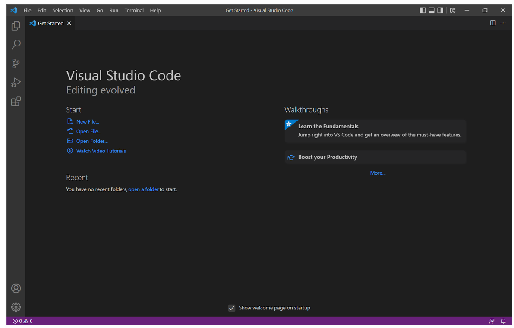
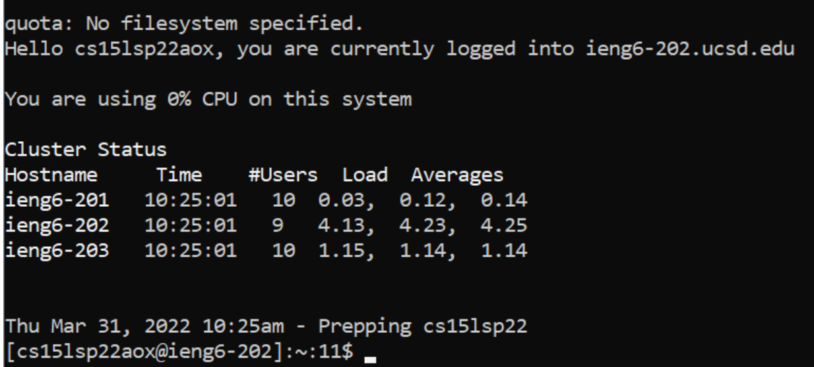

# Installing VScode

In order to download vscode, go to [this website](https://code.visualstudio.com/download). 

After downloading, you should see this image:

From there you can start coding. 

# Remotely Connecting

To connect to any server using ssh you must type in your command line `ssh username@hostname`. For this course, you would type `ssh cs15lsp22---@ieng6.ucsd.edu`, and then input your password. This is what it should look like when connected:


The password input is tedious but there is a shortcut we will go over later. 

# Trying Some Commands
Some of the most useful commands are:
`* cat \_file\_ (prints content of a file)
`* cd \_directory\_ (allows you to change directory)
`* ls \_optional directory\_ (allows you to list content of current dir or specified)
`    * Useful command is ls -alF, it displays **a**ll files, prints them in **l**ong form, and **F**ormats them.
`* cp \_source\_ \_destination\_ (copies a file to specified destination. Using -r you can copy entire directories.)
`* rm \_file to remove\_ (removes specifid file)
`    * if you want to remove an empty directory, include -r
`    * if you want to remove a nonempty directory, include -rf

Pictured below is ls -alF:


# Moving Files with `SCP`
Moving a file with `SCP` is very simple. 
Type in `scp \_local file\_ \_remote location to send\_`, input the password to the remote location, and then the file should be in the remote location, as seen in the image below:

Doing this several times could take a while, so there is a faster way of doing this. 

# SSH Keys
Using an SSH key greatly improves the speed of which you can transfer files and log in, and while it can be complicated to set up, it is worth it in the long run. 
Make sure you have ssh client installed on your local machine, and then input these commands:
```
# on client
ssh-keygen
# enter file to save the key (should be default)
/Users/<user-name>/.ssh/id_rsa
# enter passphrase (not required)
# if using windows, open powershell and run these commands:
Get-Service ssh-agent | Set-Service -StartupType Manual
Start-Service ssh-agent
Get-Service ssh-agent
ssh-add ~\.ssh\id_ed25519
# now for final step, copy the public key onto the server using:
# on server
ssh cs15lsp22aox@ieng6.ucsd.edu
mkdir .ssh
# on client
scp _.ssh location_/id_rsa.pub cs15lsp22aox@ieng6.ucsd.edu:~/.ssh/authorized_keys
# this now lets you scp or ssh onto the server from client without needing a password.
```
You should now see how much faster it is to ssh and scp into the server in the image below. For our last step, we will make the most pleasant process for remote running

# Making Remote Running Even More Pleasant
There are many methods for optimizing this but the simplest would be to do the painful proccess once, and then use up arrows to save keystrokes.
To make the first time simple, you can use semicolons and quotes to make one line do much more in the terminal. 
For example, you could do this:
`scp WhereAmI.java cs15lsp22aox@ieng6.ucsd.edu; ssh cs15lsp22aox@ieng6.ucsd.edu "javac WhereAmI.java; java WhereAmI"`
This is painful to write out the first time, but subsequent edits can be done in however long it takes you to press up arrow and enter.
Image below to show what it should look like in terminal:


